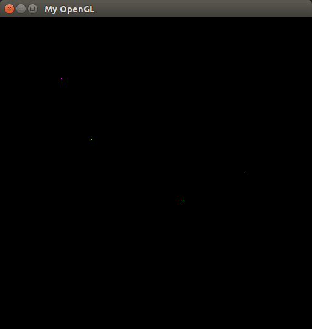
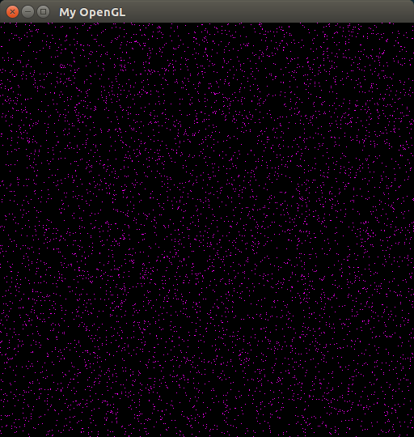
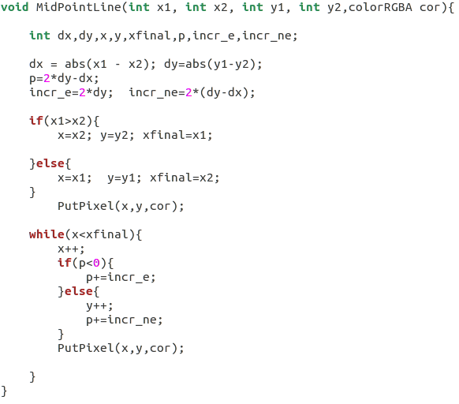
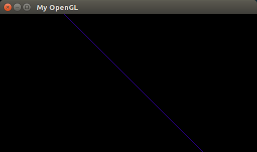
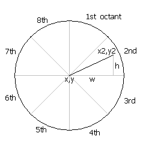
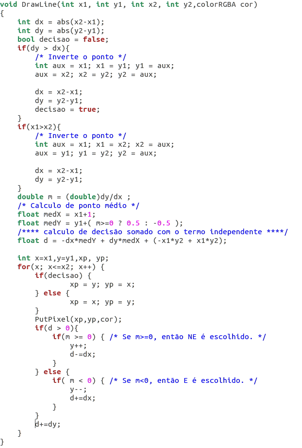
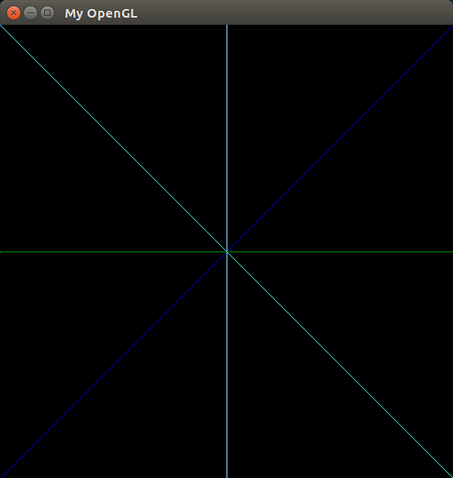
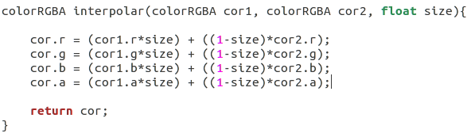
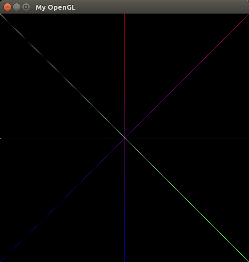
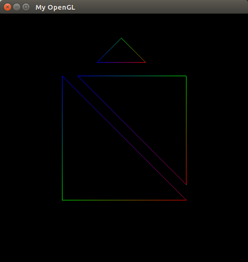

# First activity of CG UFPB.  _ Rasterization Algorithms _
Alison R. M. Barreiro - 11328393

## Menu

* [Abstract](#Abstract)
* [Introduction](#introduction)
* [Points Rasterization](#points-rasterization)
* [Digital Differential Analyzer](#digital-differential-analyzer)
* [Bresenham Algorithm](#bresenham-algorithm)
* [Drawing Triangles](#drawing-triangles)
* [Conclusion](#conclusion)
* [References](#references)
* [Build Instructions](#build-instructions)

---

### Abstract
Normally, graphs are defined through geometric primitives such as points, lines, circles, texts, etc. It may seem simple to draw a line in the video, however, this kind of routine is not as simple as it sounds. Given this, we will develop functions in conjunction with framwork, which makes writing in video memory to perform these tasks, and perform an analysis of improvements when possible, this is also important to create more efficient applications. This post consists of implementing raster algorithms for points and lines in C / C ++ language along with the GLUT and OpenGL libraries using the Framework previously made available by the teacher.

---

### Introduction
This article is about Activity 1 of the subject of Introduction to Computer Graphics, taught by Prof. Christian Pagot.

---

### Rasterizing a Point (Pixel) on the screen
A point in computing, in this case, pixel, has the following properties:

  

*   Position in plan
  
*   Color

Each device (monitor) has its own hardware specifications, and the pixel size will depend on the graphic resolution and physical size of the device. Pixel manipulation operations are essential because from this manipulation, images are constructed or altered. In addition, we can construct graphical elements more complex than a point, but, there is a sequence of actions and algorithms so that they can be constructed.

1.  Function PutPixel();

The function rasterizes a point in the video memory, receiving as parameters the position of the pixel on the screen (x, y) and its color (RGBA). Each pixel occupies 4 bytes in the video memory, whose each byte corresponds to an RGBA value. The video memory can be represented as a linear vector, having 4 times the screen size of the device. With this, we get the following function:

**offset = (x + y \* Image\_Width) \* 4;**

Understanding this, let's use the pointer **FBptr**, which initially points to the beginning of memory (0,0), with it, we will be able to point the place where we will assign the color of the Pixel.

First, let's draw some random pixels on the screen, as we can see in **The image 1**.


Now let's look more close the function destined to execute the point rasterization.
```C++
#define X_Y_IMAGE_WIDTH (x + y * IMAGE_WIDTH) * 4

void PutPixel(int x, int y, colorRGBA cor){


	if( x < 0  || y < 0  || x > IMAGE_HEIGHT || y > IMAGE_WIDTH)
	{
		return;
	
      	} else {
		FBptr[X_Y_IMAGE_WIDTH + 0] = cor.r;
		FBptr[X_Y_IMAGE_WIDTH + 1] = cor.g;
		FBptr[X_Y_IMAGE_WIDTH + 2] = cor.b;
		FBptr[X_Y_IMAGE_WIDTH + 3] = cor.a; 
	}

}    
```

The function above describes:
1. xWidth is the position of the pixel related the screen width.
2. yHeight is the position of the pixel related the screen height.
3. myRGBA is the color vector related the pixel.

The RGBA standard  to require four bytes. Each byte it is destined for the primaries color RGBA that mean RED, GREEN, BLUE and ALPHA. With this function we can draw a point on the screen like the below picture show it.

```C++
void MyGlDraw(void) { 
            PutPixel(int xWidth, int yHeight, pixRGBA); 
}      
```
<p align="center">
	<br>
	
	<h5 align="center">Image 1 - Random points</h5>
	<br>
</p>


```C++
void MyGlDraw(void) { 
           PutPixel( rand()%512,rand()%512, pixRGBA); 
}

```
<p align="center">
	<br>
	
	<h5 align="center">Image 2 - Rand Pixel</h5>
	<br>
</p>

---

### Lines Rasterization
The rasterization of a line consists of determining the pixels located between a start point and an end, which should fill this segment of the line as evenly as possible in a device (monitor), and can be vertical, horizontal or diagonal.

However, it is not so simple, because in the case of a diagonal line we can have a low density in the line, so that the density is as uniform as possible, we must select the largest possible number of pixels between the two extreme pixels of the line, the nearest pixels.

#### Bresenham Algorithm

For the line drawing, we will use the Bresenham algorithm, since it has greater precision in the results and the execution speed, when its ends are located in the pixels ** P1 ** and ** P2 ** of coordinates ** (x1 , y1) ** and ** (x2, y2) **, respectively.

This algorithm uses only integer arithmetic, and incrementally calculates the pixels that best approximate the ideal line, and therefore allows for greater performance. The algorithm is based on the criterion of the midpoint.

Após a decisão de qual pixel será considerado, deve-se atualizar e utilizar o valor do algoritmo de decisão. Se foi o último pixel escolhido, M será incrementado somente na direção x .

**Image 3**, a simplified version of the Bresenham Algorithm. For more complex operations, we will write the improved Bresenham, in **Image 6**, which inverts the points.

<p align="center">
	<br>
	
	<h5 align="center">Image 3 - Bresenham</h5>
	<br>
</p>

<p align="center">
	<br>
	
	<h5 align="center">Image 4 - Bresenham padrão</h5>
	<br>
</p>

In fact, the Bresenham algorithm, in this case, using this framwork, draws only on the first octant. So we need to improve the code for use in this framwork, we can observe the new result in **Image 7**.

<p align="center">
	<br>
	
	<h5 align="center">Image 5 - Octants</h5>
	<br>
</p>

<p align="center">
	<br>
	
	<h5 align="center">Image 6 - Bresenham algorithm for all octants.</h5>
	<br>
</p>

```C++
void MyGlDraw(void) { 
	DrawLine(512,0,0,512,pixRGBA1); 
	DrawLine(256,0,256,512,pixRGBA2); 
	DrawLine(0,0,512,512,pixRGBA3); 
	DrawLine(0,256,512,256,pixRGBA4);
}
```

<p align="center">
	<br>
	
	<h5 align="center">Image 7 - Bresenham for all octants.</h5>
	<br>
</p>


### Linear Color Interpolation

Color interpolation is commonly used in graphic computing, mainly used in object rasterization, in this work we will use in the implementation of the Bresenham algorithm in the DrawLine function. We need to take into account, first, the size of the line, for proper interpolation, this is of extra importance because we do not want an incorrect interpolation. Let's give an overview of the interpolation methods to later detail, and later do a case study. Interpolation is a technique that "fills a gap" between two numbers. Most APIs expose linear interpolation based on three parameters: the starting point X1, Y1, and the end point X2, Y2 and a value value between 0 and 1 that moves along the segment that connected them: color = (X1 (X1, Y1) = (X2, Y2) - (X1, Y1)) * size When t = 1, then (X1, Y1) , Y2). The beauty of this formula is that it is easy to understand, efficient to implement, and works in any dimension. The dimensions only require reading independently the X and Y components. It always returns points on the line connecting (X1, Y1) and (X2, Y2), regardless of the number of dimensions.

The main idea is to first calculate the size of the line with respect to its points, for this we use the Function: **final_size = √(((x2-x1)*(x2-x1))+((y2-y1)*(y2-y1)))**; Having the size of the line in hand, we calculate its relation by the size of the line at the moment, that is, a division of initial size at the end, with this we have a variation between 0 ~ 1; Then we get a simple incremental calculation, since it is in loop in for, **size = (current_size++)/final_size**; 

<p align="center">
	<br>
	
	<h5 align="center">Image 8 - Interpolate function.</h5>
	<br>
</p>


Now we can calculate the color of each pixel, sent to the PutPixel function, as we can see in **Image 9**.

```C++
void DrawLine(int x1, int y1, int x2, int y2, colorRGBA pixRGBA1, colorRGBA pixRGBA2){
...
	current_size++;                                                                                                                         color = interpolate(pixRGBA1,pixRGBA2, current_size/final_size); 
	PutPixel(xWidth, yHeight,color);
...
}
```

<p align="center">
	<br>
	
	<h5 align="center">Image 10 - DrawTriangle with Color Interpolation.</h5>
	<br>
</p>

```C++
void MyGlDraw(void) { 
	DrawTriangle(128,128,384,384,128,384,red,blue,gree); 
	DrawTriangle(160,128,384,352,384,128,red,blue,gree); 
	DrawTriangle(200,100,300,100,250,50,red,blue,gree);
}
```

<p align="center">
	<br>
	
	<h5 align="center">Image 11 - Drawing triangles.</h5>
	<br>
</p>


---

## Conclusion

### Results and discussion
Rasterizing points provides a myriad of possibilities in computer graphics, a straight-line algorithm, the Bresenham is of great utility and efficiency.

### Difficulties encountered
Difficulties was in the implementation of the Bresenham algorithm and color interpolation, the main difficulty with Bresenham was with respect to the eight octants, after much research and reading, it was possible to write a valid algorithm for all octants.

Regarding color interpolation. Even following Foley, and the information on Linear interpolation in stackoverflow, continued to present some errors and simply did not work, since the final calculation always resulted in 0.00001, then the algorithm was changed, and only adding an incremental interpolation with respect to the size of the line and the current size of the line.

---

### References

1.  Anotações de Aula do Prof. Christian Azambuja Pagot 
2.  http://tech-algorithm.com/articles/drawing-line-using-bresenham-algorithm/ (07/2019)
3.  https://www.geeksforgeeks.org/bresenhams-line-generation-algorithm/ (07/2019)
4.  http://www.edepot.com/algorithm.html (07/2019)

---
